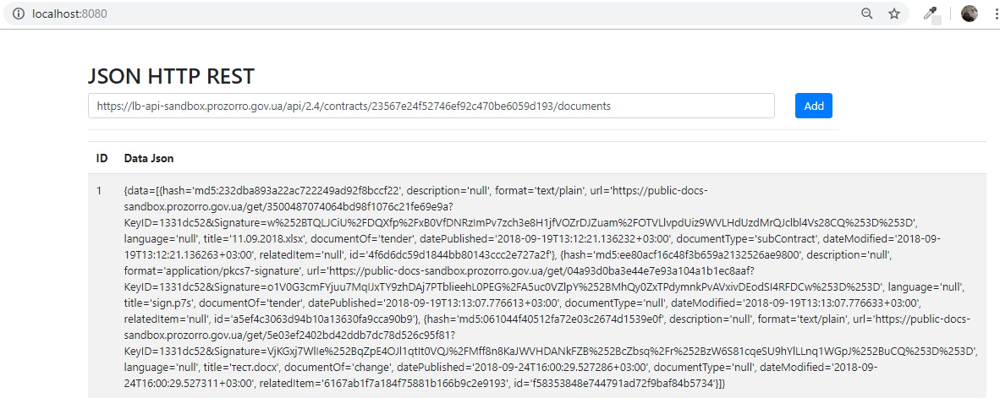
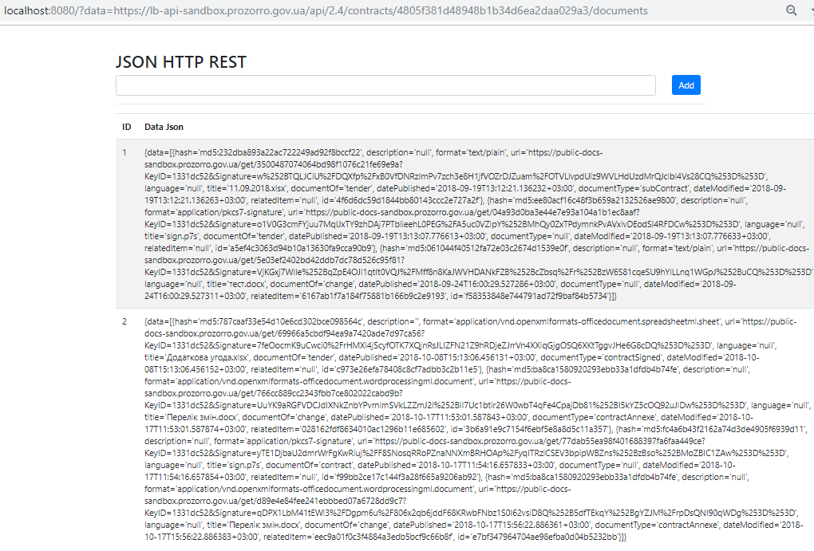
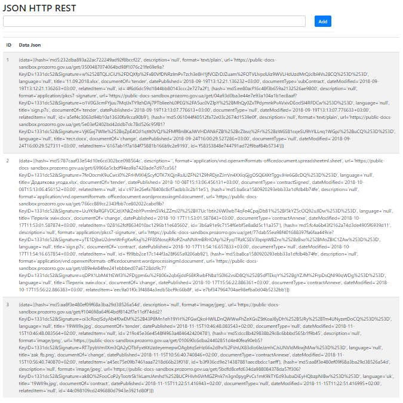

# JSON HTTP REST DB

Control systems versions: Maven;

Framework: SpringBoot;

Database: PostgreSQL, JPA, Hibernate, flyway;

Http client: OkHttp;

WEB: Freemarker, HTML, Bootstrap;

Test: Mockito, JUnit.

API
```
GET /
   Response:
         list data source db
```
```
GET /?data=url

   Request:
      param data=url
      
   Response:
      list data source db
```

```
Post /

  Body: 
      data=url

   Response:
      list data source db
      
```

Test Linc 

https://lb-api-sandbox.prozorro.gov.ua/api/2.4/contracts/23567e24f52746ef92c470be6059d193/documents 

https://lb-api-sandbox.prozorro.gov.ua/api/2.4/contracts/4805f381d48948b1b34d6ea2daa029a3/documents 

https://lb-api-sandbox.prozorro.gov.ua/api/2.4/contracts/47fa8764e1b74f4db58f84c9db460566/documents 

Post /


GET /?data=https://lb-api-sandbox.prozorro.gov.ua/api/2.4/contracts/4805f381d48948b1b34d6ea2daa029a3/documents 


GET /

